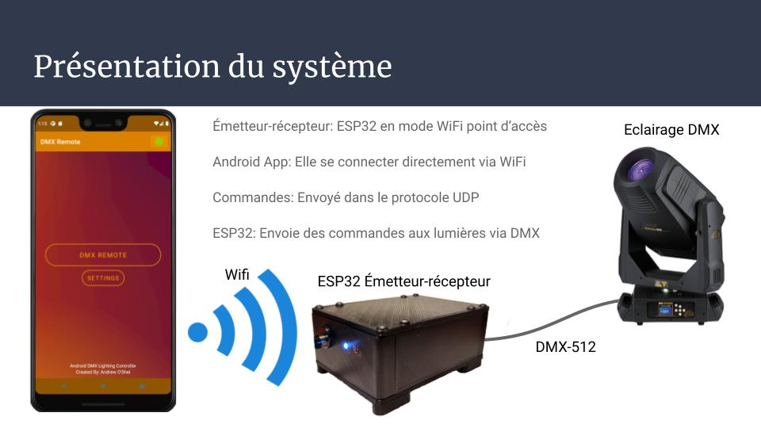
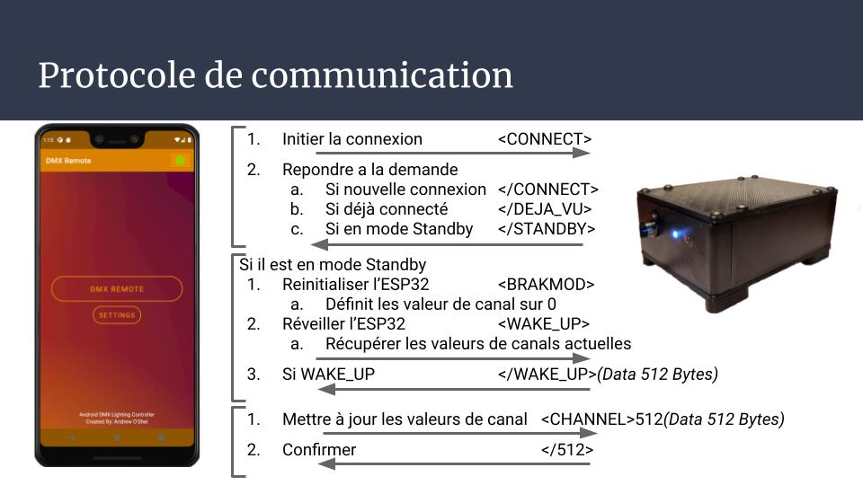
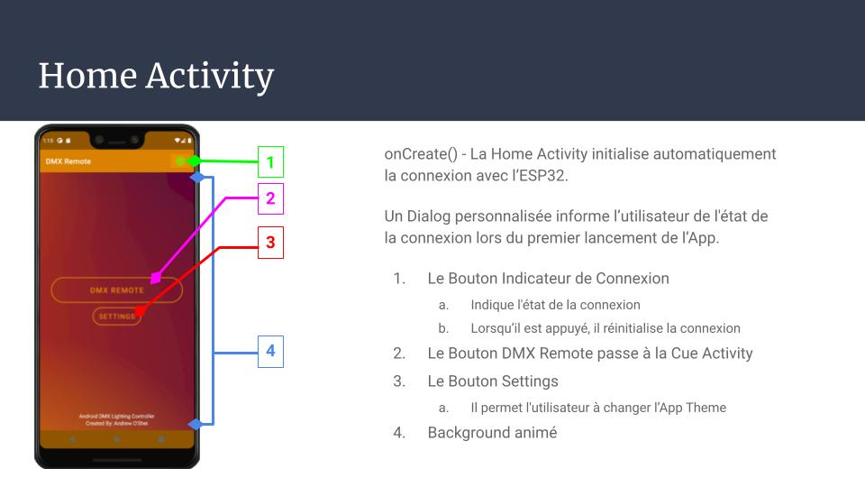
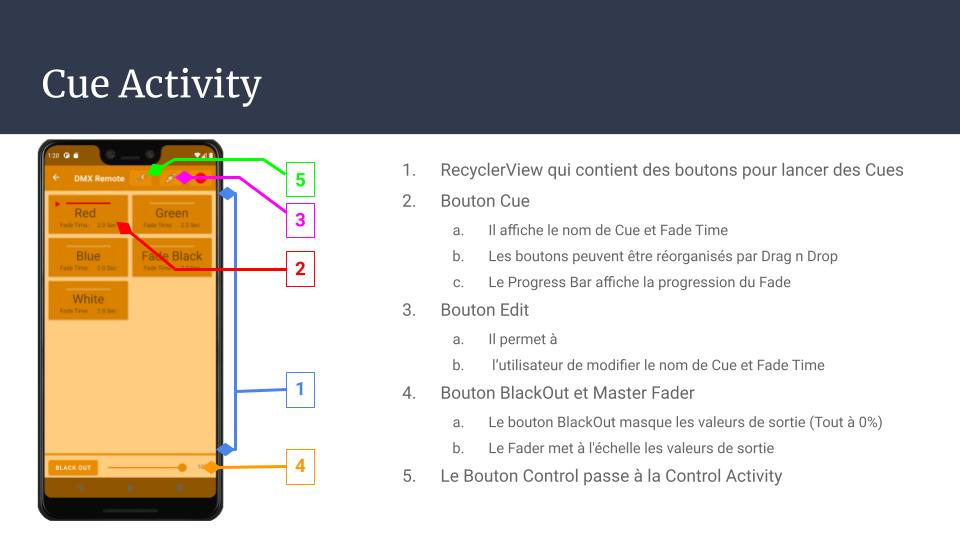
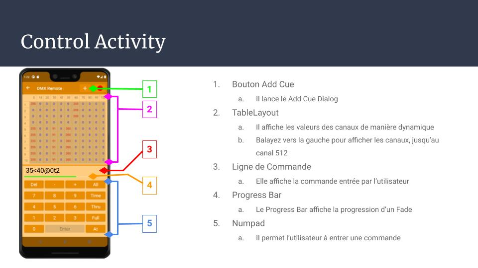
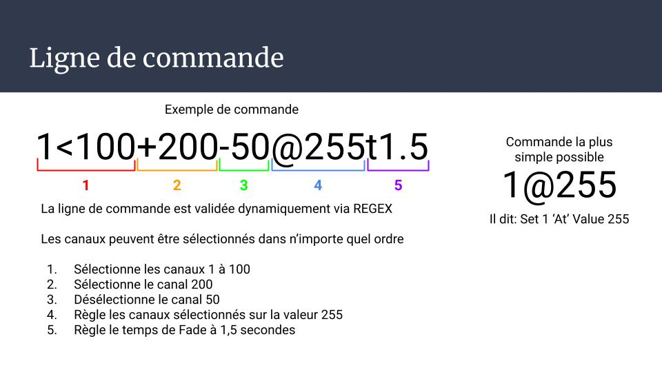

# Android DMX Remote
An Android-based DMX Lighting Controller

Created by: Andrew O'Shei

Minimum Android Version Supported: Marshmallow 6.0 (API 23)

Note: Le code de l'ESP32 été écrit avec Arduino IDE en utilisant un coeur modifié et le library LXESP32DMX disponible d'ici: https://github.com/claudeheintz/LXESP32DMX

